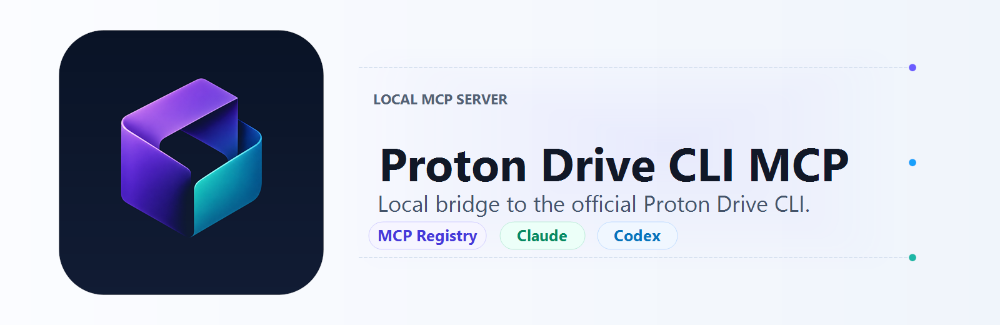

# Proton Drive CLI MCP



<!-- mcp-name: io.github.borealstack/proton-drive-cli-mcp -->

[](LICENSE)
[](server.json)
[](package.json)
[](package.json)
[](mcpb/manifest.json)
[](plugins/proton-drive-cli-mcp)

Local MCP server for Proton Drive. It wraps the official `proton-drive` CLI, so
authentication, encrypted Drive behavior, and session storage stay delegated to
Proton's tooling instead of being reimplemented here.

## Highlights

| Area | What is ready |
| --- | --- |
| MCP clients | stdio server runnable with `npx -y @borealstack/proton-drive-cli-mcp` |
| Proton auth | Browser login through the official Proton Drive CLI |
| CLI install | Optional managed install from Proton's download index with SHA-512 verification |
| Distribution | npm package metadata, MCP Registry `server.json`, Codex plugin metadata, and Claude MCPB metadata |
| Safety | No Proton credentials in MCP config, no custom public-link passwords in command arguments, confirmation gates for destructive tools |

## Quick Start

```powershell
npx -y @borealstack/proton-drive-cli-mcp
```

Add the server to any MCP client as a local stdio server:

```json
{
  "mcpServers": {
    "proton-drive": {
      "command": "npx",
      "args": ["-y", "@borealstack/proton-drive-cli-mcp"],
      "env": {}
    }
  }
}
```

Then call `proton_drive_auth_status`. If the CLI is not authenticated, call
`proton_drive_auth_login`, finish the browser sign-in, and check status again.

## Install Paths

| Client | Install option |
| --- | --- |
| Claude Code | `claude mcp add --transport stdio proton-drive -- npx -y @borealstack/proton-drive-cli-mcp` |
| Claude Desktop | Use the stdio JSON above, or install the `.mcpb` bundle after the first release: [proton-drive-cli-mcp.mcpb](https://github.com/borealstack/proton-drive-cli-mcp/releases/latest/download/proton-drive-cli-mcp.mcpb) |
| Codex | Plugin metadata is in [plugins/proton-drive-cli-mcp](plugins/proton-drive-cli-mcp) |
| VS Code | `code --add-mcp "{\"name\":\"proton-drive\",\"command\":\"npx\",\"args\":[\"-y\",\"@borealstack/proton-drive-cli-mcp\"]}"` |
| npm | [@borealstack/proton-drive-cli-mcp](https://www.npmjs.com/package/@borealstack/proton-drive-cli-mcp) after publication |

The MCPB and npm links become active after the first public release.

## Requirements

- Node.js 22+ for the published package and built server.
- Bun 1.3+ for development and Bun test coverage.
- The official Proton Drive CLI installed, or network access to Proton's CLI
  download index.
- A Proton account login completed by the official CLI, or browser access for
  `proton_drive_auth_login`.

The server resolves the CLI in this order:

1. `PROTON_DRIVE_CLI_PATH`
2. The managed user-local install path
3. `proton-drive` or `proton-drive.exe` in the current directory or common download paths
4. `proton-drive` on `PATH`
5. Auto-install from `https://proton.me/download/drive/cli/index.html`

Set `PROTON_DRIVE_CLI_AUTO_INSTALL=0` to disable managed install. Set
`PROTON_DRIVE_CLI_INSTALL_DIR` to override the managed install directory.

## Tools

Core tools:

- Auth: `proton_drive_auth_status`, `proton_drive_auth_login`, `proton_drive_auth_login_status`, `proton_drive_auth_login_cancel`, `proton_drive_auth_logout`
- CLI: `proton_drive_cli_install`, `proton_drive_cli_version`, `proton_drive_cli_help`
- Files: `proton_drive_list`, `proton_drive_info`, `proton_drive_create_folder`, `proton_drive_upload`, `proton_drive_download`
- Mutations: `proton_drive_rename`, `proton_drive_copy`, `proton_drive_move`, `proton_drive_trash`, `proton_drive_restore`, `proton_drive_delete`, `proton_drive_empty_trash`
- Sharing: `proton_drive_sharing_status`, `proton_drive_sharing_invite`, `proton_drive_sharing_remove`, `proton_drive_sharing_set_url`, `proton_drive_sharing_remove_url`
- Invitations: `proton_drive_invitation_list`, `proton_drive_invitation_accept`, `proton_drive_invitation_reject`

Permanent delete, empty trash, logout, sharing removal, and invitation
accept/reject require `confirm: true`.

Full tool details are in [docs/TOOLS.md](docs/TOOLS.md).

## Development

```powershell
bun install
bun run typecheck
bun test
bun run build
npm test
```

During local development, run the server directly with Bun:

```json
{
  "mcpServers": {
    "proton-drive-dev": {
      "command": "bun",
      "args": ["run", "<path-to-repo>/src/index.ts"],
      "env": {}
    }
  }
}
```

Run `bun run smoke:cli` only when intentionally testing against a real logged-in
Proton Drive account.

## Safety And Legal

This is an independent project and is not affiliated with Proton AG. Proton and
Proton Drive are Proton AG marks used only to identify interoperability with
Proton Drive and the official Proton Drive CLI.

The server delegates sign-in and session storage to the official CLI, and it
does not request or store Proton credentials. Custom public-link passwords are
not accepted through MCP tool arguments because command-line arguments can be
visible to local process inspection.

See [LICENSE](LICENSE), [NOTICE](NOTICE), [DISCLAIMER.md](DISCLAIMER.md), and
[SECURITY.md](SECURITY.md).

## References

- [Proton: Using Proton Drive CLI](https://proton.me/support/drive-cli)
- [Proton blog: Introducing Proton Drive CLI](https://proton.me/blog/proton-drive-cli)
- [Official CLI README](https://github.com/ProtonDriveApps/sdk/blob/main/js/cli/README.md)
- [Model Context Protocol TypeScript SDK](https://github.com/modelcontextprotocol/typescript-sdk)
